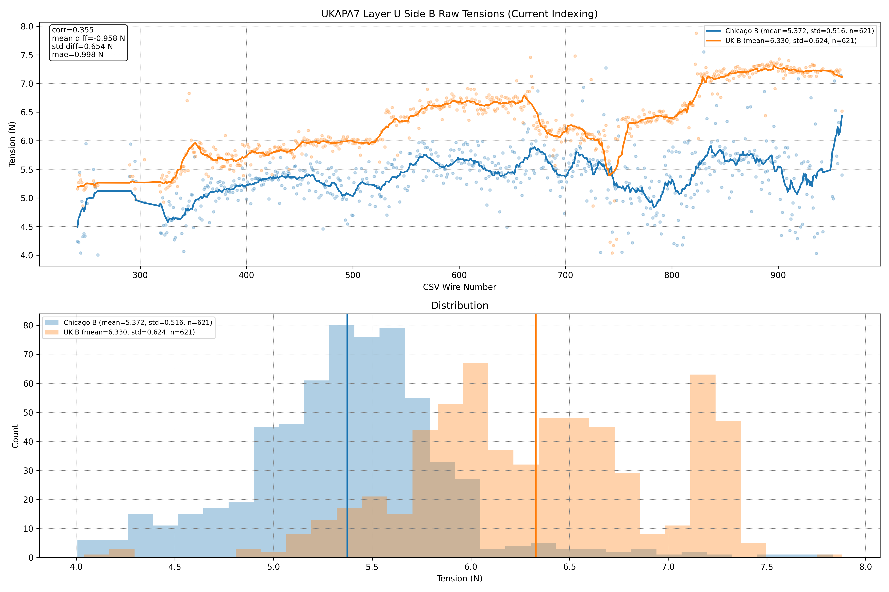
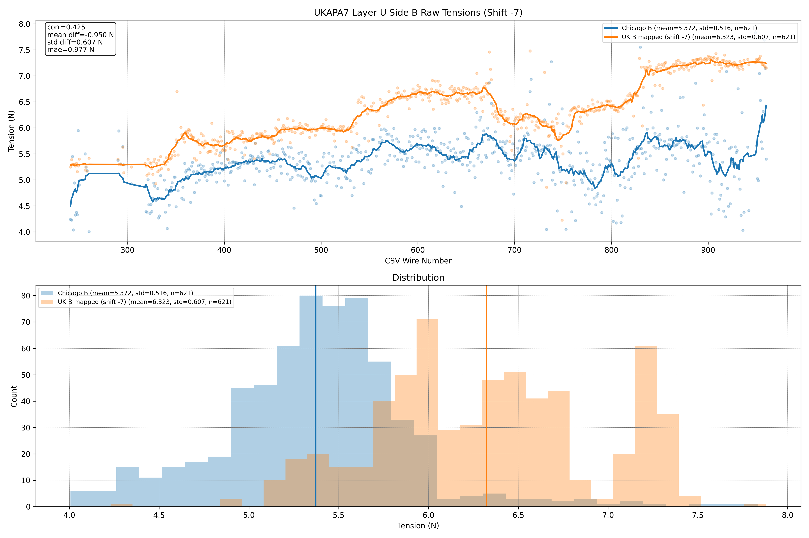
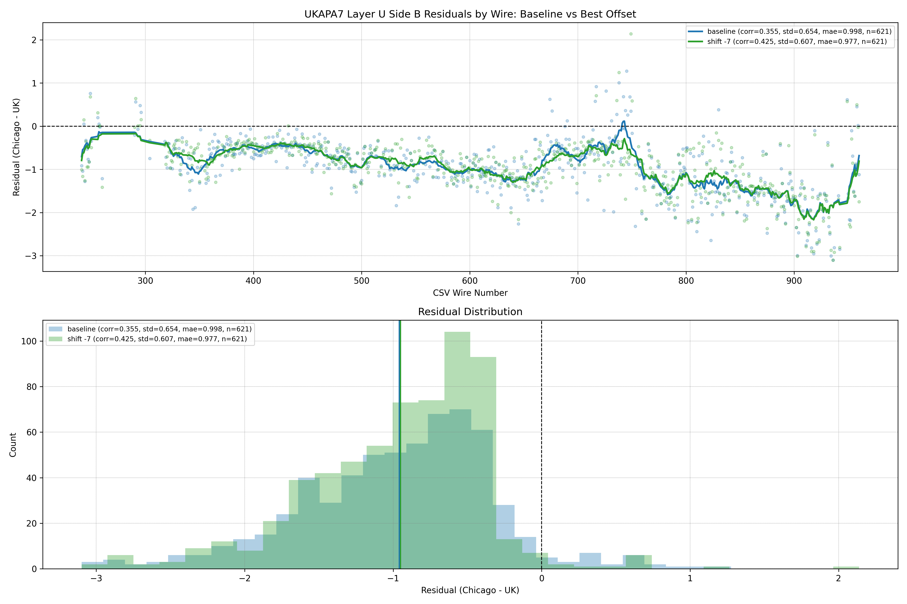
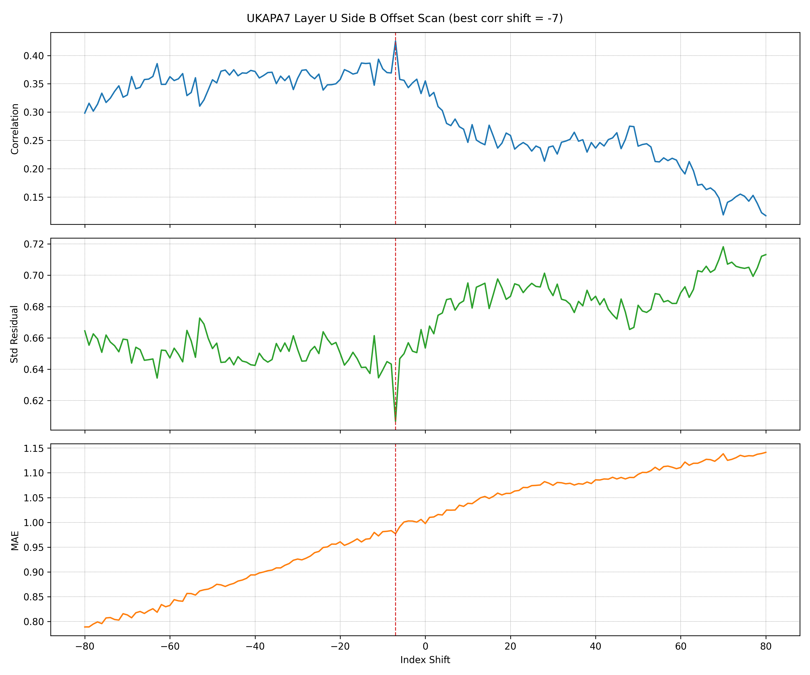

# UKAPA7 Layer U Partial B-Side Offset Report

This report repeats the UKAPA7 comparison workflow for the U layer using:

- UK factory measurements in `UKAPA7U.json`
- Chicago factory measurements in
  `data/tension_summaries/tension_summary_UKAPA7_U.csv`

Residual definition throughout: `Chicago - UK`.

## Data Availability

- The UK JSON contains both side A and side B measurements.
- The Chicago summary CSV contains only side B data.
- The available Chicago side-B wires span wire numbers `241` through `960`.
- The current CSV contains `621` non-null side-B measurements and `0` non-null
  side-A measurements.

Because there is no Chicago side-A data in the summary CSV, this report is
necessarily limited to the available side-B subset.

## Working Assumption

For this U-layer analysis, the working assumption is:

- there is no side-B reversal
- there may be a constant wire-number offset

So the tested model family is a simple shift:

`Chicago B wire w` -> `UK B wire w + k`

with no reversal term.

## Executive Summary

- Under the current indexing, the partial B-side comparison is already strongly
  negative on average, with mean residual about `-0.958 N`.
- Scanning constant shifts from `-80` to `+80` shows the best correlation at
  shift `-7`.
- That shift improves correlation from `0.355` to `0.425` and reduces the
  residual width from `0.654 N` to `0.607 N`.
- The improvement is real but not transformative. The Chicago and UK traces
  remain substantially offset even after the best tested small shift.

## Source Artifacts

- Raw B comparison, current indexing:
  `data/tension_plots/tension_raw_B_baseline_UKAPA7_U.png`
- Raw B comparison, best offset:
  `data/tension_plots/tension_raw_B_shifted_UKAPA7_U.png`
- Residual comparison, baseline vs best offset:
  `data/tension_plots/tension_residual_B_offset_comparison_UKAPA7_U.png`
- Offset scan:
  `data/tension_plots/tension_shift_scan_B_UKAPA7_U.png`
- Aligned comparison table:
  `data/tension_summaries/tension_B_offset_comparison_UKAPA7_U.csv`

## Raw B-Side Data, Current Indexing

{ width=100% }

### Current-Indexing Summary

| Comparison | Count | Chicago Mean (N) | UK Mean (N) | Corr | Mean Diff (N) | Std Diff (N) | MAE (N) |
| --- | ---: | ---: | ---: | ---: | ---: | ---: | ---: |
| Side B baseline | 621 | 5.372 | 6.330 | 0.355 | -0.958 | 0.654 | 0.998 |

## Raw B-Side Data, Best Constant Offset

{ width=100% }

### Best-Offset Summary

| Comparison | Count | Chicago Mean (N) | UK Mean (N) | Corr | Mean Diff (N) | Std Diff (N) | MAE (N) |
| --- | ---: | ---: | ---: | ---: | ---: | ---: | ---: |
| Side B shift `-7` | 621 | 5.372 | 6.323 | 0.425 | -0.950 | 0.607 | 0.977 |

### Interpretation

- A simple negative shift of `-7` wires produces the best correlation in the
  tested range.
- The improvement is visible in both the line plot and the histogram overlap.
- Even after the shift, the Chicago values remain systematically below the UK
  values by about `0.95 N` on average.

## Residual Comparison

This figure compares the residuals for:

- baseline indexing
- the best tested constant offset, shift `-7`

{ width=100% }

### Residual Statistics

| Model | Count | Corr | Mean (N) | Median (N) | Std (N) | MAE (N) | RMSE (N) | Negative Fraction |
| --- | ---: | ---: | ---: | ---: | ---: | ---: | ---: | ---: |
| Baseline | 621 | 0.355 | -0.958 | -0.877 | 0.654 | 0.998 | 1.160 | 0.958 |
| Shift `-7` | 621 | 0.425 | -0.950 | -0.850 | 0.607 | 0.977 | 1.128 | 0.974 |

### Interpretation

- The best constant shift tightens the residual distribution and increases the
  correlation.
- The residuals remain strongly negative even after the shift, which means the
  dominant effect is still a large average Chicago-versus-UK difference.
- Since only part of side B is present in the CSV, this should be interpreted
  as a partial-window comparison, not a statement about the entire layer.

## Offset Scan

{ width=100% }

### Interpretation

- The correlation curve peaks near shift `-7`.
- The residual standard deviation also reaches a local minimum around the same
  region.
- Larger negative shifts can lower MAE somewhat, but they do not give the best
  correlation and are less compelling as a simple indexing-offset explanation.

## Conclusion

For the available U-layer data, there is no need to invoke a reversal model.
The Chicago summary contains only a partial side-B window, and within that
window the best simple index-offset explanation is a shift of `-7` wires.

That shift improves the match, but only moderately. The comparison still shows
an overall large negative offset between Chicago and UK measurements, and the
absence of Chicago side-A data limits how far the interpretation can be pushed.
