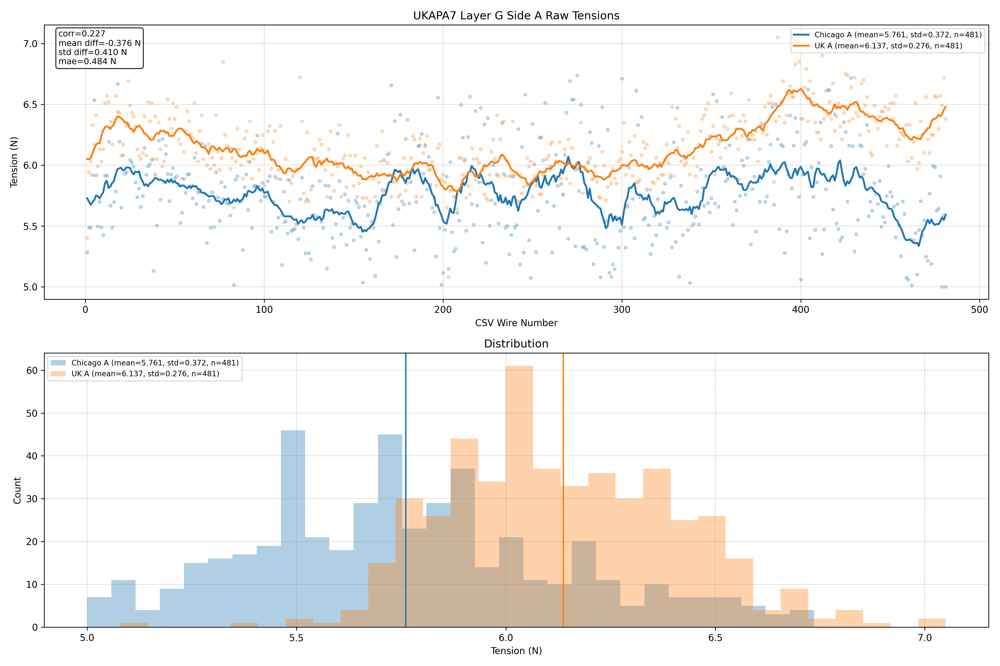
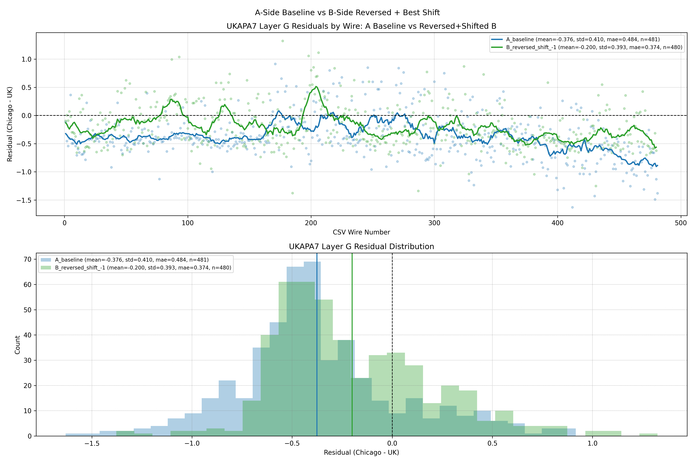
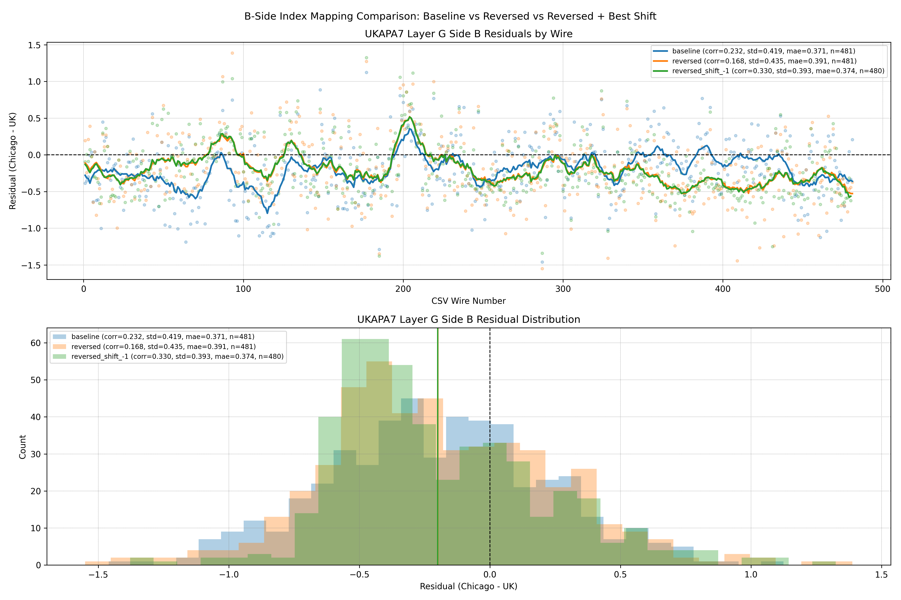
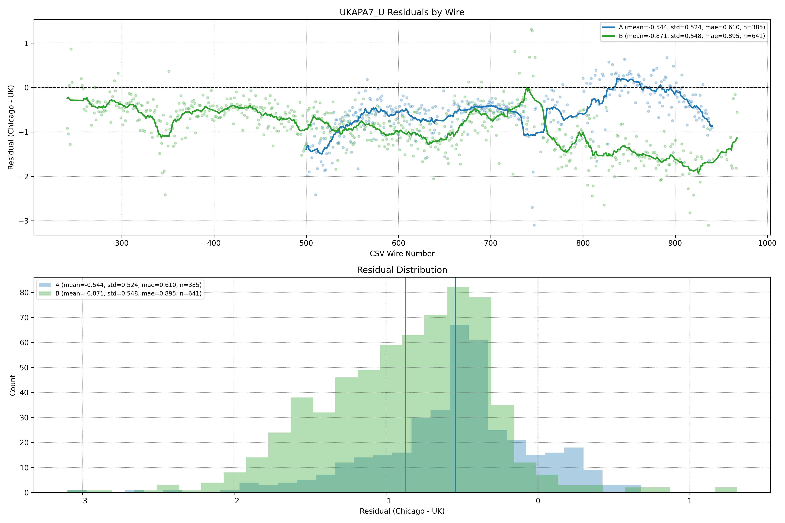

# UKAPA7 After Storage and Shipment

### A quick look at what changed between the UK and Chicago measurements

- Framing question: what happened to wire tensions after long storage of the APA and transatlantic shipment from the UK to Chicago?
- We compare UK factory measurements from December 10, 2023 against Chicago measurements from March 11, 2026.
- Residual means `Chicago - UK`, so a negative value means the Chicago tension came out lower.
- Headline result: Chicago tensions are lower on both G and U where measured, but the pattern differs by layer and side.

---

# What We're Comparing

- **G layer:** full comparison on both sides, `481` aligned wires on side A and `481` on side B.
- **U layer:** partial Chicago coverage only, with `385` aligned wires on side A and `641` on side B.
- That means the G-layer story is more complete, while the U-layer story should be treated as a partial-window comparison.
- Not all U wires were accessible in Chicago, so any U-layer conclusion needs to stay provisional.

---

# G Layer: Broadly Lower After Storage and Shipment

- Side A shows a clear negative shift, with mean residual `-0.376 N`.
- Corrected side B is also negative, with mean residual `-0.200 N`.
- Taken at face value, both sides are consistent with lower tensions after storage and shipment, although the size of the shift is not identical side to side.

---

# G Side B: Procedure Matters Too

- The best side-B match is **reversed indexing plus shift `-1`**, which is what we would expect if the Chicago scan started from the wrong end.
- With that correction, correlation improves from `0.232` to `0.330`.
- The residual width also tightens from `0.419 N` to `0.394 N`.
- So the G-layer comparison looks like a mix of real physical change and a procedural side-B mapping issue.

---

# U Layer: Lower in Chicago, but Harder to Interpret

- Side A is lower in Chicago on average, with mean residual `-0.544 N`, but the wire-by-wire correlation is weak at `0.104`.
- Side B is also lower, and more consistently so, with mean residual `-0.871 N` and correlation `0.509`.
- Important caveat: not all U wires were accessible in Chicago, so this is not yet a full-layer comparison.
- Another caveat: frame deformation after the G layer may have changed the shape of the U-layer tension distribution, which could be part of why the U behavior looks different.

---

# What This Says About Storage and Shipment

- U side B does **not** mainly look like a reversal problem; the best simple index model is a small shift of `-7`.
- That shift helps, but only modestly: correlation improves from `0.509` to `0.586`, and residual width drops from `0.548 N` to `0.492 N`.
- The dominant U-side-B effect is still a large negative offset, with the mean staying near `-0.87 N`.
- Bottom line: storage plus shipment are consistent with lower measured tensions in Chicago, G side B also carries a procedural indexing effect, and the U-layer story remains provisional because coverage is partial and post-G frame deformation may have altered the U distribution.

---

