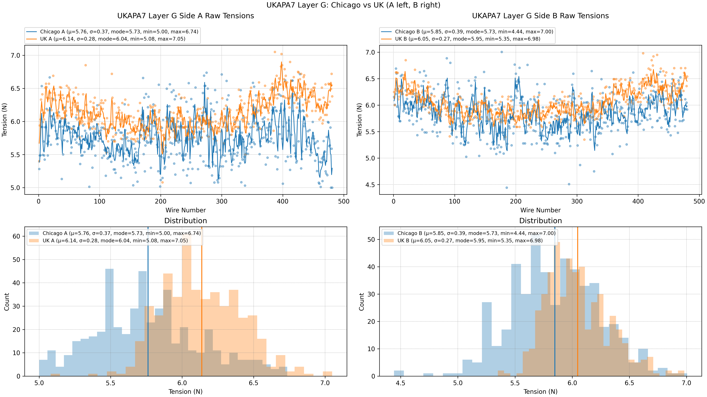
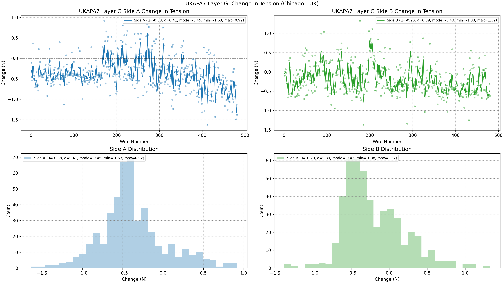
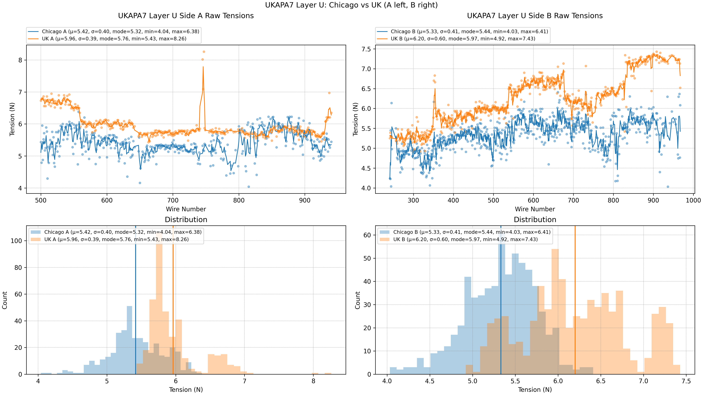
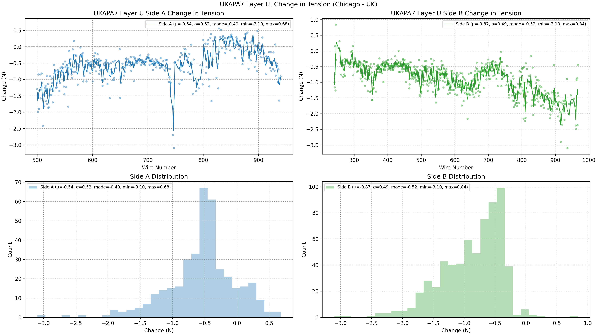
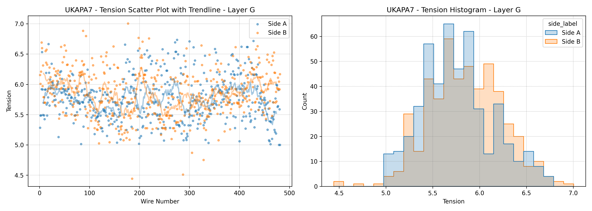
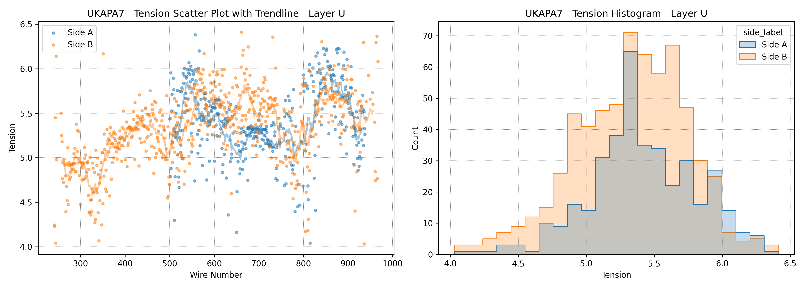

```{python}
from pathlib import Path
import sys


def find_repo_root(start: Path) -> Path:
    for path in (start, *start.parents):
        if (path / "pyproject.toml").exists() and (path / "src/dune_tension").exists():
            return path
    raise RuntimeError("Could not find dune-monorepo root")


ROOT = find_repo_root(Path.cwd())
SRC = ROOT / "src"
if str(SRC) not in sys.path:
    sys.path.insert(0, str(SRC))

from dune_tension.ukapa7_comparison.generate_landscape_display_plots import (
    save_layer_change_in_tension_plot,
    save_layer_landscape_plot,
)

EXPERIMENT_DIR = ROOT / "dune_tension/experiments/UKAPA7_comparison"
G_ACTION_JSON = ROOT / "dune_tension/apa_uk7g.json"
U_ACTION_JSON = ROOT / "dune_tension/UKAPA7U.json"
G_SUMMARY_CSV = ROOT / "dune_tension/data/tension_summaries/tension_summary_UKAPA7_G.csv"
U_SUMMARY_CSV = ROOT / "dune_tension/data/tension_summaries/tension_summary_UKAPA7_U.csv"

save_layer_landscape_plot(
    action_json=G_ACTION_JSON,
    summary_csv=G_SUMMARY_CSV,
    layer="G",
    output_path=EXPERIMENT_DIR / "ukapa7_landscape_G.png",
)
save_layer_change_in_tension_plot(
    action_json=G_ACTION_JSON,
    summary_csv=G_SUMMARY_CSV,
    layer="G",
    output_path=EXPERIMENT_DIR / "ukapa7_change_in_tension_G.png",
)
save_layer_landscape_plot(
    action_json=U_ACTION_JSON,
    summary_csv=U_SUMMARY_CSV,
    layer="U",
    output_path=EXPERIMENT_DIR / "ukapa7_landscape_U.png",
)
save_layer_change_in_tension_plot(
    action_json=U_ACTION_JSON,
    summary_csv=U_SUMMARY_CSV,
    layer="U",
    output_path=EXPERIMENT_DIR / "ukapa7_change_in_tension_U.png",
)
```

## UKAPA7 After Storage and Shipment

- What happened to wire tensions after storage and transatlantic shipment from the UK to Chicago?
- UK factory measurements: December 10, 2023.
- Chicago measurements: March 11, 2026.
- Headline result: Chicago tensions are lower by about 0.5 N on average, probably from relaxation during storage.
- No tensions are out of the 4.0-8.5 N specification, and there is no evidence of shipping damage.

## What We Are Comparing

- **G layer:** full comparison on both sides, with 481 aligned wires on side A and 481 on side B.
- **U layer:** partial Chicago coverage, with 385 aligned wires on side A and 641 on side B.
- U-layer wires were accessed through a slit cut in the G wires near the middle of the APA.

## G Layer

- Most wires on both sides changed by about -0.45 N, with Chicago lower.
- Wire-by-wire differences range from -1.63 N to +1.32 N, with sigma about 0.4 N.
- Apparent tension increases are less likely than compounded measurement uncertainty.

## G Layer: Raw Tensions



## G Layer: Change in Tension



## U Layer

- Most wires dropped by about -0.5 N.
- Differences range from -3.1 N to +0.68 N, with sigma about 0.5 N.
- The negative outliers suggest measurement errors in the UK data.
- Frame deformation after the G layer may have changed the U-layer tension distribution.

## U Layer: Raw Tensions



## U Layer: Change in Tension



## Storage and Shipment Interpretation

- A decrease of about 0.5 N over 2.25 years is consistent with wire relaxation under stress.
- Apparent +0.5 N changes are probably not real increases, but combined measurement uncertainty.
- Apparent -3 N changes are also probably not real, and likely reflect mistaken measurements at Daresbury.
- Tension changes, even large apparent ones, should not disqualify acceptance if the final tension is acceptable.

## Final UKAPA7 G Tension



## Final UKAPA7 U Tension


