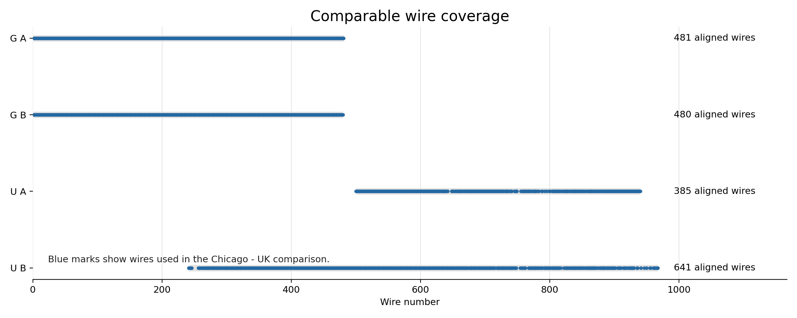
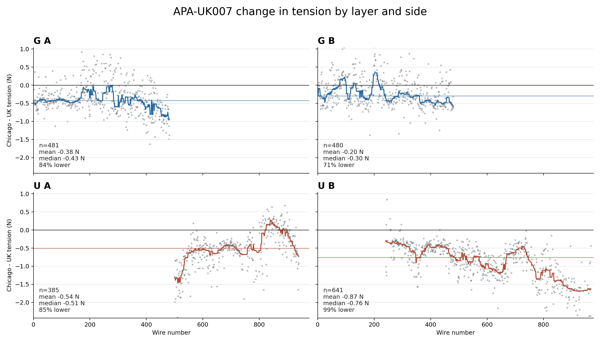
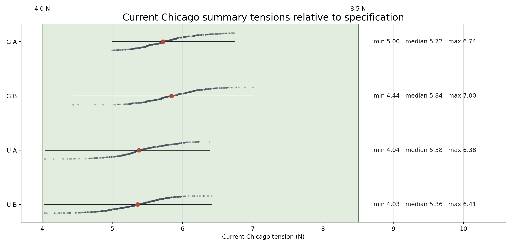
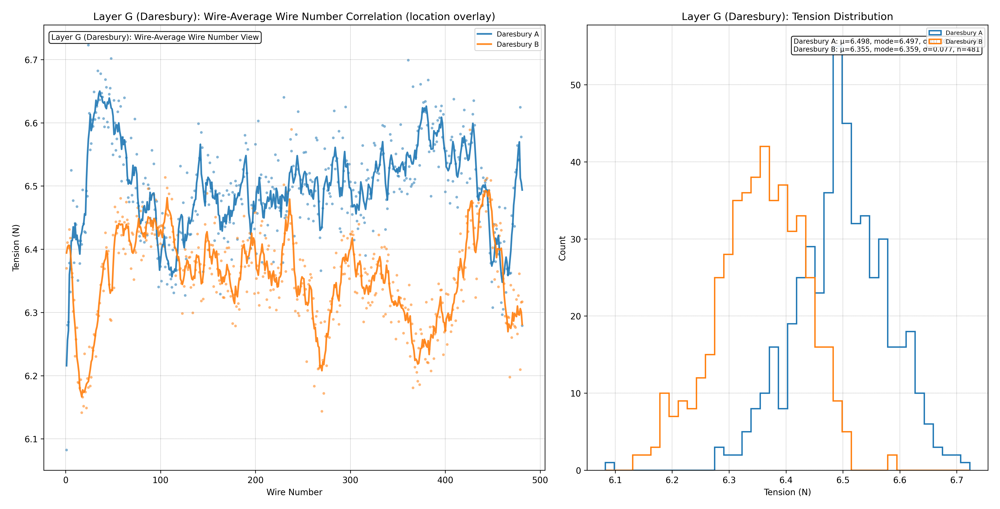
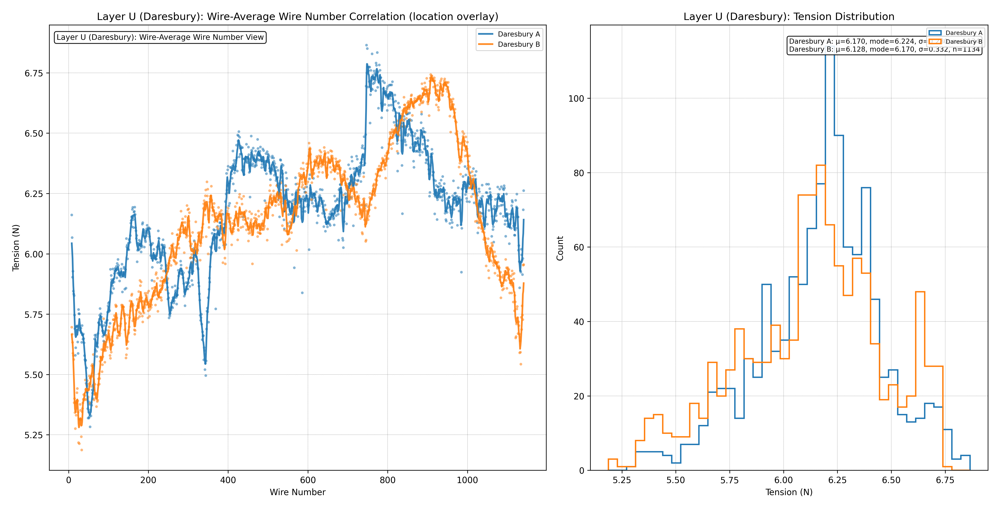

<!-- markdownlint-disable MD013 MD033 -->

# APA-UK007 After Storage and Shipment

Chicago measurements are lower than the UK source records, but
the current measured G and U tensions remain inside the 4.0-8.5 N specification.

Comparison of UK action JSON records with current Chicago
tension summary files.

---

## Bottom Line

- APA-UK007 was stored for about `2.25` years and then shipped across the
  Atlantic.
- The comparable Chicago tensions are lower in every layer-side group.
- The typical shift is modest: about `-0.2` to `-0.4 N` for G and about
  `-0.5` to `-0.9 N` for the measured U subset.
- No current Chicago summary value in these G and U files is outside the
  `4.0-8.5 N` specification.

---

## Measurement Basis

| Layer | UK source | Chicago source | Comparison note |
| --- | --- | --- | --- |
| G | APA-UK007 G action JSON, uploaded `2023-12-10` | `tension_summary_UKAPA7_G.csv` | Full A coverage; B uses corrected reverse/shift alignment |
| U | APA-UK007 U action JSON, uploaded `2023-11-21` | `tension_summary_UKAPA7_U.csv` | Partial Chicago coverage through access slit |

- Residuals are `Chicago - UK`; negative values mean Chicago measured lower.
- The UK measurements were probably laser + ziptie + LabVIEW.
- The Chicago measurements used the winder, laser, compressed air, and Python
  processing.

---

## Comparable Coverage

The G comparison is effectively full coverage. The U
comparison is a measured subset, so its result should be read as a subset
comparison rather than a full-layer statement.

---

## Measurement Comparability

- G-layer access and pose are the closest comparison between the UK and Chicago
  measurements.
- U-layer wires were accessed through a slit cut in the G wires.
- The U-layer pose is closer to the ASF DWA access geometry, but with winder
  support.
- Measurements on the finished APA could not use capos.

---

## Change in Tension

Each panel uses the same vertical scale. Points are
individual wires; the colored line is a local median trend.

---

## G Layer Result

- Side A: mean residual `-0.38 N`, median `-0.43 N`.
- Side A: `84%` of aligned wires are lower in Chicago.
- Side B: mean residual `-0.20 N`, median `-0.30 N`.
- Side B: `71%` of aligned wires are lower in Chicago.

- Residual widths are about `0.4 N` on both sides.
- Some wires measured higher in Chicago, so the change is not a uniform
  wire-by-wire offset.
- The corrected B-side comparison uses `480` aligned wires.

---

## U Layer Result

- Side A subset: mean residual `-0.54 N`, median `-0.51 N`.
- Side A subset: `85%` of aligned wires are lower in Chicago.
- Side B subset: mean residual `-0.87 N`, median `-0.76 N`.
- Side B subset: `99%` of aligned wires are lower in Chicago.

- Residual widths are about `0.5 N` on both sides.
- U side A has `385` aligned wires; U side B has `641`.
- This is a partial-subset comparison and not a full U-layer survey.

---

## Current Tensions Relative to Specification

All plotted Chicago summary values are within the
4.0-8.5 N specification band.

---

## What the Data Show

| Observation | Interpretation |
| --- | --- |
| Chicago tensions are lower on average in G A, G B, U A, and U B. | The robust comparison result is a downward shift after storage and shipment. |
| Current measured values remain in specification. | The data do not show an out-of-spec tension signature. |
| Residuals have visible spread and long tails. | Per-wire change alone is not a stable acceptance criterion. |
| U coverage and access differ from G. | U results should be interpreted with the partial-coverage and access limits attached. |

---

## What the Data Do Not Separate

- The comparison does not uniquely identify the cause of the lower values.
- Plausible contributors include wire relaxation under tension, measurement
  method differences, access geometry, frame state, and handling effects.
- The data alone do not distinguish storage effects from shipment effects.
- The tension data do not replace visual or mechanical inspection for shipping
  damage.

---

## Recommendation

- Use relaxed absolute tension acceptance ranges, not change from the UK record
  alone.
- Treat long-tailed per-wire changes as diagnostic evidence, not pass/fail
  criteria.
- Keep the `4.0-8.5 N` current-tension range as the primary tension acceptance
  check unless a project-level relaxed range supersedes it.
- Based on the current interpretation, an additional decrease below `0.5 N`
  over the next four years would be expected.

---

## Backup: G Raw Tensions

---

## Backup: U Raw Tensions

---

## Backup: Population Profiles

---

## Discussion

- Are the current G and U measured values acceptable under the project tension
  criteria?
- What external inspection evidence should be paired with this tension
  comparison?
- Should future acceptance use a relaxed absolute range rather than historical
  per-wire change?
